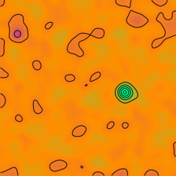
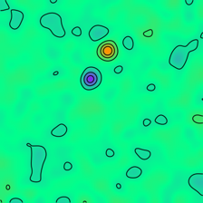
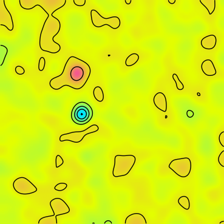

# Spatial ResNet

## Overview

The Spatial ResNet is a modified ResNet18 architecture that incorporates spatial information using a custom SpatialSoftmax layer. The model calculates the expected 2D coordinate for each channel, enhancing its ability to capture spatial relationships in the data.

## Mathematical Dependence on Softmax-transformed Matrices for Expected Point Estimation

Let $A$ be a $k \times k$ matrix, and $S$ is $A$ after the softmax function $f: \mathbb{R}^{k \times k} \rightarrow \mathbb{R}^{k \times k}$, that is $S = f(A)$.

Flatten $S$, where $S_{(x,y)}$ denotes the element at position $(x, y)$ of $S$:

$$
S_{\text{flat}} = [S_{(0,0)}, S_{(0,1)}, \ldots, S_{(k-1,k-1)}]
$$

And it holds that $\sum S_{\text{flat}} = 1$.

We can interpret $S_{\text{flat}}$ as the probability distribution over the points of interest.

Now, construct an array of coordinates:

$$
C_{k} = \begin{bmatrix}
0 & 0 & \cdots & 0 & 1 & \cdots & k-1 \\
0 & 1 & \cdots & k-1 & 0 & \cdots & k-1 \\
\end{bmatrix}
$$

Multiplying them, we obtain:

$$
C_kS_{flat}^T = \sum_{0\leq x,y < k }\begin{bmatrix}
x  \\
 y
\end{bmatrix} \times S_{(x,y)} = \begin{bmatrix}
E[x] \\
E[y]
\end{bmatrix}
$$

Here, $E[x]$ and $E[y]$ represent the expected values for $x$ and $y$ coordinates, respectively, based on the probabilities of each point.

This enables us to calculate the expected point of interest by using the softmax-transformed matrix $S$ and the coordinate array $C_k$.

## generate.py
The script uses synthetic data to create images with Gaussian noise and two randomly placed points. These images are stored in the "pictures" directory, while the coordinates of the two points in each image are saved in a JSON file called "ans.json."

For demonstration purposes:

